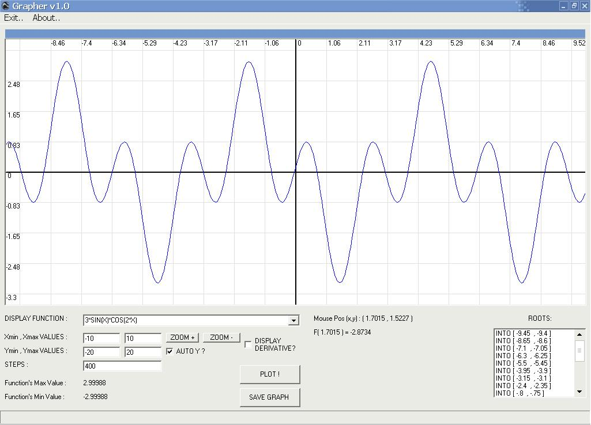



## Function Grapher

### Description

This is a very simple program that can plot mathematical functions.
 
### More Info
 

             |
---                |---
**Submitted On**   |2007-09-10 16:14:04
**By**             |[garz0r7](https://github.com/Planet-Source-Code/PSCIndex/blob/master/ByAuthor/garz0r7.md)
**Level**          |Beginner
**User Rating**    |5.0 (10 globes from 2 users)
**Compatibility**  |VB 6\.0
**Category**       |[Math/ Dates](https://github.com/Planet-Source-Code/PSCIndex/blob/master/ByCategory/math-dates__1-37.md)
**World**          |[Visual Basic](https://github.com/Planet-Source-Code/PSCIndex/blob/master/ByWorld/visual-basic.md)
**Archive File**   |[Function\_G2082879112007\.zip](https://github.com/Planet-Source-Code/garz0r7-function-grapher__1-69311/archive/master.zip)

